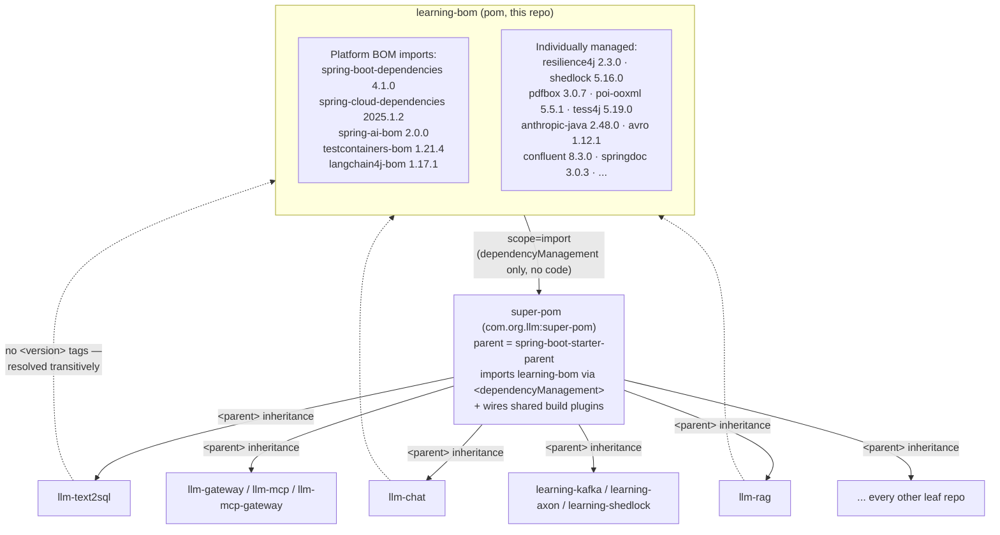
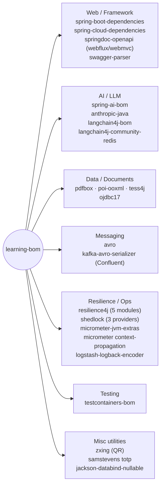

# learning-bom


## Table of contents

1. 🔨 [1. The problem: dependency version sprawl across a multi-repo organization](#1-the-problem-dependency-version-sprawl-across-a-multi-repo-organization)
2. 🔨 [2. How Maven's `<dependencyManagement>` + `scope=import` mechanism actually works](#2-how-mavens-dependencymanagement--scopeimport-mechanism-actually-works)
3. 🔨 [3. How this BOM is structured, section by section](#3-how-this-bom-is-structured-section-by-section)
4. 🏷️ [4. Deliberately held-back versions — and why](#4-deliberately-held-back-versions--and-why)
5. 🔨 [5. Position in the workspace's three-tier dependency-management chain](#5-position-in-the-workspaces-three-tier-dependency-management-chain)
6. 🚀 [6. How to import (already wired — service repos should not repeat this)](#6-how-to-import-already-wired--service-repos-should-not-repeat-this)
7. 🔨 [7. How to add a new managed dependency](#7-how-to-add-a-new-managed-dependency)
8. 🔨 [8. Quick reference — all managed dependencies](#8-quick-reference--all-managed-dependencies)
9. 🔨 [9. Versioning policy for this BOM itself](#9-versioning-policy-for-this-bom-itself)

**groupId:** `com.org.learning` · **artifactId:** `learning-bom` · **packaging:** `pom` · **current version:** `1.1.0`

- **What it is:** a `pom`-packaged Maven **Bill of Materials (BOM)** — declares *versions* only. No Java sources, no jar, never on anyone's classpath directly.
- **Its one job:** `import`-scoped into the `dependencyManagement` of one other POM — [`super-pom`](../super-pom).
- **Effect:** every leaf service in this developer's `~/projects` workspace (`llm-text2sql`, `llm-chat`, `llm-rag`, `llm-gateway`, `llm-mcp`, `llm-mcp-gateway`, `llm-deep-agent`, `llm-eval`, `llm-langchain4j`, `llm-OKF`, `learning-kafka`, `learning-graphql`, `learning-axon`, `learning-shedlock`, `learning-reactive`, `learning-utility`, `learning-wiremock`, `learning-testing-mutation`, and others) resolves *exactly the same* version of Spring Boot, Spring Cloud, Spring AI, Resilience4j, Testcontainers, PDFBox, POI, Tesseract, the Anthropic Java SDK, LangChain4j, Avro, Confluent's Kafka tooling, Shedlock, and a dozen smaller libraries.
- **Zero repetition:** none of those repos ever write a `<version>` tag themselves.

This document covers:

- What problem a BOM solves
- How Maven's import-scope mechanism works under the hood
- How this BOM is organized, section by section
- Why several versions are *deliberately* held back from latest
- Where it sits in the three-tier dependency-management chain spanning this developer's multi-repo Maven setup

---

<a id="1-the-problem-dependency-version-sprawl-across-a-multi-repo-organization"></a>
## 1. 🔨 The problem: dependency version sprawl across a multi-repo organization

- This workspace is not one monolith — roughly twenty independent Maven repos, each with its own `pom.xml`, built and released independently.
- They share a substantial overlapping set of third-party libraries: every repo needs Spring Boot, most need Spring AI and/or LangChain4j, several need Testcontainers, Resilience4j, Shedlock, or PDFBox/POI/Tesseract.
- Without a shared mechanism, each repo's `pom.xml` would need its own `<version>` tag per dependency — producing a well-known set of failure modes:

<ul>

- **Version drift.** `llm-chat` pins `resilience4j` 2.2.0 while `llm-gateway` pins 2.4.0. Nobody planned this — each repo was bumped at a different time by whoever touched it that week. Behavior (and available APIs) now differs between services meant to be part of the same platform.
- **The "diamond dependency" problem.** Two libraries a service depends on (e.g. `spring-ai-starter-model-anthropic` and `langchain4j-community-redis`) may each transitively drag in different versions of a shared artifact (Jackson, Netty, Reactor). Maven's "nearest wins" rule then picks a version based on POM depth and declaration order — essentially arbitrary — unless something upstream pins it explicitly.
- **Upgrade fatigue.** Bumping Spring Boot 4.0 → 4.1 across twenty repos means twenty pull requests, twenty rounds of "did I get the version string right," and twenty chances for a typo or a forgotten transitive bump (e.g. Resilience4j's Spring Boot 3 integration needing to move in lockstep).
- **Silent incompatibility.** Some libraries are version-sensitive to their *host* framework in ways Maven doesn't enforce — they just fail at runtime. This BOM currently encodes exactly one such case explicitly (Resilience4j 2.4.0 refusing to start under Spring Boot 4.x — see §4 below). A BOM is the place to centralize that knowledge once, instead of rediscovering it per repo.
- **No single place to reason about "what are we actually running."** When a security advisory drops for, say, Apache POI, an engineer needs one file to open, not twenty.

</ul>

- **The fix:** a BOM inverts the responsibility. Instead of every consumer declaring "I want version X of library L," the BOM declares "this organization's sanctioned version of L is X," and consumers just declare *that they use L* — no version at all.
- The version resolves transitively, from a single upstream source of truth.
- Upgrading becomes a one-line property bump in one repo (`learning-bom`), plus a version bump of the BOM dependency in `super-pom` — not N edits scattered across N repos.
- This is the same pattern Spring uses for `spring-boot-dependencies`, and that Spring Cloud, Spring AI, and Testcontainers each ship as `*-bom` artifacts. `learning-bom` sits one layer above all of those, aggregating them plus everything else this organization's services need that isn't covered by an upstream BOM.

---

<a id="2-how-mavens-dependencymanagement--scopeimport-mechanism-actually-works"></a>
## 2. 🔨 How Maven's `<dependencyManagement>` + `scope=import` mechanism actually works

Maven has two related-but-distinct concepts that are frequently confused:

### 2.1 `<dependencyManagement>` on its own

- A `<dependencyManagement>` block does **not** add any dependency to a project's classpath.
- It's purely a table: "if this artifact ever ends up on the classpath (declared directly, by a child, or pulled transitively), and no closer declaration overrides it, use this version / scope / exclusions."
- A child POM that inherits a parent's `dependencyManagement` and declares:

```xml
<dependency>
    <groupId>org.apache.pdfbox</groupId>
    <artifactId>pdfbox</artifactId>
</dependency>
```

- ...with **no** `<version>` gets the version from the nearest enclosing `dependencyManagement` entry matching on `groupId:artifactId` (and `classifier`/`type` if present).
- This is standard parent → child POM inheritance — works the same whether the managed entry was declared directly in the parent or arrived via an import (below).

### 2.2 `scope=import` — the BOM-specific piece

A plain `<dependency>` entry inside `<dependencyManagement>` can point at another `pom`-packaged artifact and declare `<scope>import</scope>`, e.g. this BOM's own top section:

```xml
<dependency>
    <groupId>org.springframework.boot</groupId>
    <artifactId>spring-boot-dependencies</artifactId>
    <version>${spring-boot.version}</version>
    <type>pom</type>
    <scope>import</scope>
</dependency>
```

- This tells Maven: *"fetch `spring-boot-dependencies:4.1.0`'s own `<dependencyManagement>` block wholesale, and splice all of its entries into mine, as if I typed them all by hand."*
- Two properties matter a great deal in practice:

1. **Additive/textual, not inherited-by-reference.** The importing POM's own entries merge with everything imported. Order matters: if two imported BOMs (or an import and a local entry) both manage the same `groupId:artifactId`, **the first declaration encountered wins** — later ones are silently ignored. This is why this BOM's platform-BOM block is annotated `<!-- import order matters: first declaration wins -->` and always imports `spring-boot-dependencies` before `spring-cloud-dependencies`, `spring-ai-bom`, and `testcontainers-bom` — Spring Cloud's and Spring AI's BOMs sometimes manage a coordinate (e.g. Jackson, Netty) that Spring Boot also manages, and the intent is for Spring Boot's own mutually-tested set to win.
2. **`scope=import` only works inside `<dependencyManagement>`, on a `<type>pom</type>` dependency.** It's a compile-time signal to Maven's model builder, not a runtime classpath scope like `compile`/`runtime` — the effective POM behaves as though those entries were pasted in directly.

### 2.3 Why this matters for a 3-tier chain

- Import-scope resolves when Maven builds the **effective POM**; normal parent/child inheritance also merges `dependencyManagement` top-down — the two compose transparently.
- A POM can *import* a BOM in its own `dependencyManagement`, and every one of its *children* (via ordinary `<parent>` inheritance) inherits the fully-resolved, merged table — without ever mentioning the BOM's `groupId:artifactId`.
- This is exactly the trick this workspace relies on (§5): `super-pom` imports `learning-bom`, and every leaf repo with `super-pom` as its Maven `<parent>` inherits `learning-bom`'s entire managed version table for free, with zero awareness that `learning-bom` exists.

---

<a id="3-how-this-bom-is-structured-section-by-section"></a>
## 3. 🔨 How this BOM is structured, section by section

The full `pom.xml` is one `<dependencyManagement>` block with clearly commented sections. Walkthrough below, matching the actual file.

### 3.1 Platform BOMs (imported first, in a deliberate order)

```xml
<!-- ===== Platform BOMs (import order matters: first declaration wins) ===== -->
```

| Imported BOM                                          | Property                 | Version    |
|-------------------------------------------------------|--------------------------|------------|
| `org.springframework.boot:spring-boot-dependencies`   | `spring-boot.version`    | `4.1.0`    |
| `org.springframework.cloud:spring-cloud-dependencies` | `spring-cloud.version`   | `2025.1.2` |
| `org.springframework.ai:spring-ai-bom`                | `spring-ai.version`      | `2.0.0`    |
| `org.testcontainers:testcontainers-bom`               | `testcontainers.version` | `1.21.4`   |

- These four are themselves upstream-maintained BOMs, each managing dozens to hundreds of their own artifacts (e.g. `spring-boot-dependencies` manages `spring-boot-starter-web`, `jackson-databind`, `tomcat-embed-core`, and hundreds more).
- `spring-cloud-dependencies` manages Spring Cloud Gateway/Config/OpenFeign/etc.; `spring-ai-bom` manages every `spring-ai-*-spring-boot-starter` and underlying model-client artifacts; `testcontainers-bom` manages every module (`postgresql`, `kafka`, `junit-jupiter`).
- Importing them here, in this order, gives every downstream repo a mutually-tested, internally-consistent framework version set — `learning-bom` never needs to know or re-declare their individual member artifacts.

### 3.2 Oracle JDBC

```xml
<!-- ===== Oracle JDBC ===== -->
```
- `com.oracle.database.jdbc:ojdbc17` at `${ojdbc.version}` (`23.26.2.0.0`).
- Oracle doesn't publish a BOM covering this driver conveniently, so it's pinned directly as an individually-managed artifact.

### 3.3 Resilience4j

```xml
<!-- ===== Resilience4j ===== -->
```
- Five artifacts — `resilience4j-spring-boot3`, `resilience4j-reactor`, `resilience4j-circuitbreaker`, `resilience4j-micrometer`, `resilience4j-retry` — all pinned together to `${resilience4j.version}` (`2.3.0`).
- See §4.1 for why this is held below latest.

### 3.4 Observability

```xml
<!-- ===== Observability ===== -->
```
- `io.github.mweirauch:micrometer-jvm-extras` (`${micrometer-jvm-extras.version}` = `0.3.0`) — adds JVM metrics (GC, classloading, thread pools) beyond core Micrometer.
- `io.micrometer:context-propagation` (`${micrometer-context-propagation.version}` = `1.2.1`) — carries `ThreadLocal`/`Reactor Context` state (MDC, tracing spans) across async and reactive boundaries.

### 3.5 Structured logging

```xml
<!-- ===== Structured logging ===== -->
```
- `net.logstash.logback:logstash-logback-encoder` (`${logstash-logback.version}` = `9.0`) — emits JSON-structured log lines consumable by a log aggregator (ELK/Loki/etc.) instead of plain-text log4j-style formatting.

### 3.6 Distributed scheduling

```xml
<!-- ===== Distributed scheduling ===== -->
```
- `net.javacrumbs.shedlock:shedlock-spring`, `shedlock-provider-jdbc-template`, and `shedlock-provider-redis-spring`, all at `${shedlock.version}` (`5.16.0`).
- Shedlock prevents the same `@Scheduled` job from running concurrently on more than one instance of a horizontally-scaled service, using a JDBC row lock or Redis lock as the distributed mutex, depending on the provider chosen.
- See §4.3 for why this is held back from the 7.x line.

### 3.7 Document processing

```xml
<!-- ===== Document processing ===== -->
```
| Artifact                        | Property            | Version  | Purpose                                              |
|----------------------------------|---------------------|----------|-------------------------------------------------------|
| `org.apache.pdfbox:pdfbox`      | `pdfbox.version`    | `3.0.7`  | Read/write/manipulate PDF documents                  |
| `org.apache.poi:poi-ooxml`      | `poi-ooxml.version` | `5.5.1`  | Read/write Office Open XML (`.docx`/`.xlsx`/`.pptx`) |
| `net.sourceforge.tess4j:tess4j` | `tess4j.version`    | `5.19.0` | JNA bindings to Tesseract OCR                        |

- These three together cover the document-ingestion pipeline used by the RAG/document-processing repos: extracting text from PDFs, Office documents, and scanned/image-based pages via OCR.

### 3.8 AI SDKs

```xml
<!-- ===== AI SDKs ===== -->
```
- `com.anthropic:anthropic-java` at `${anthropic-java.version}` (`2.48.0`) — the official Anthropic Java SDK.
- Used directly (outside Spring AI's abstraction) wherever a repo needs lower-level access to the Claude Messages API, streaming, or tool-use primitives that Spring AI's starter doesn't expose.

### 3.9 langchain4j

```xml
<!-- ===== langchain4j ===== -->
```
- `dev.langchain4j:langchain4j-bom` is imported (`scope=import`, like the platform BOMs in §3.1) at `${langchain4j-bom.version}` (`1.17.1`), managing the core LangChain4j modules (chains, memory, embedding stores, tool integration) as one coordinated set.

Separately, further down the file:

```xml
<dependency>
    <!-- Community modules live on their own (beta) version track, outside langchain4j-bom. -->
    <groupId>dev.langchain4j</groupId>
    <artifactId>langchain4j-community-redis</artifactId>
    <version>${langchain4j-redis.version}</version>
</dependency>
```

- `langchain4j-community-redis` is pinned individually at `${langchain4j-redis.version}` (`1.17.0-beta27`) rather than picked up from the BOM import.
- Reason: `langchain4j-community` modules (Redis, and others) release on their own beta cadence, independent of the core BOM's line — they aren't managed by it at all.
- This entry exists because a repo in this workspace (`llm-rag` or similar) needs Redis-backed embedding storage.

### 3.10 Kafka / Avro ecosystem

```xml
<!-- Kafka / Avro ecosystem -->
```
| Artifact                             | Property            | Version  |
|---------------------------------------|---------------------|----------|
| `org.apache.avro:avro`               | `avro.version`      | `1.12.1` |
| `io.confluent:kafka-avro-serializer` | `confluent.version` | `8.3.0`  |

- Avro provides the schema/serialization format; Confluent's `kafka-avro-serializer` integrates Avro (de)serialization with the Confluent Schema Registry for Kafka producers/consumers.
- Note: `io.confluent` artifacts are **not** published to Maven Central — any repo consuming this managed version needs Confluent's Maven repository configured (`super-pom` already declares it under `<repositories>`).

### 3.11 Test utilities

```xml
<!-- ===== Test utilities ===== -->
```
- `io.swagger.parser.v3:swagger-parser` (`${swagger-parser.version}` = `2.1.45`) — parses/validates OpenAPI/Swagger specification documents, used in tests asserting a service's generated OpenAPI spec is well-formed or matches a contract.

### 3.12 OpenAPI / Swagger UI

```xml
<!-- ===== OpenAPI / Swagger UI ===== -->
```
- `org.springdoc:springdoc-openapi-starter-webflux-ui` and `org.springdoc:springdoc-openapi-starter-webmvc-ui`, both at `${springdoc.version}` (`3.0.3`).
- Generates OpenAPI 3 documentation and a Swagger UI page from Spring MVC or WebFlux controller annotations, depending on which stack a repo uses.

### 3.13 QR code processing

```xml
<!-- ===== QR code processing ===== -->
```
- `com.google.zxing:core` and `com.google.zxing:javase`, both at `${zxing.version}` (`3.5.4`).
- Generate/decode QR codes (and other barcode formats); `javase` layers `java.awt`/ImageIO bindings on top of the platform-independent `core`.

### 3.14 TOTP

```xml
<!-- ===== TOTP ===== -->
```
- `dev.samstevens.totp:totp` at `${samstevens-totp.version}` (`1.7.1`) — implements RFC 6238 Time-based One-Time Password generation/validation, used for 2FA/MFA flows.

### 3.15 `openapi-generator` "spring" template runtime dependency

```xml
<!-- ===== openapi-generator "spring" template runtime dependency ===== -->
```
- `org.openapitools:jackson-databind-nullable` at `${jackson-databind-nullable.version}` (`0.2.10`).
- Not a library any repo depends on deliberately — it's a small runtime shim the `openapi-generator-maven-plugin`'s `spring` template (configured in `super-pom`) emits references to in generated model classes, to distinguish "field absent" from "field explicitly set to `null`" in JSON.
- Pinned here so generated code always compiles against a known-good version regardless of which repo runs the generator.

---

<a id="4-deliberately-held-back-versions--and-why"></a>
## 4. 🏷️ Deliberately held-back versions — and why

- Three properties in this BOM are pinned *below* the latest available upstream release, each with an inline comment in `pom.xml` explaining the reasoning.
- These are the most important entries to understand — they represent accumulated debugging knowledge that would otherwise be rediscovered independently by whoever next runs `mvn versions:display-dependency-updates` and blindly bumps everything to latest.

### 4.1 Resilience4j — held at `2.3.0`

```xml
<!-- resilience4j 2.4.0 ships SpringBoot3Verifier that refuses Spring Boot 4.x at startup — hold at 2.3.0 -->
<resilience4j.version>2.3.0</resilience4j.version>
```

- Resilience4j 2.4.0 introduced a `SpringBoot3Verifier` that fails fast if the Resilience4j Spring Boot integration loads under a major version it wasn't verified against.
- Despite this BOM already being on **Spring Boot 4.1.0**, the 2.4.0 verifier hard-codes an expectation of Spring Boot 3.x and throws at startup rather than degrading gracefully.
- Pragmatic fix: stay one minor version back, on 2.3.0, which predates the verifier and works correctly against Spring Boot 4.x.
- Revisit once Resilience4j ships a release whose verifier is aware of Spring Boot 4.

### 4.2 Testcontainers — held at `1.21.4`

```xml
<!-- Testcontainers 2.x renames module artifacts (junit-jupiter/postgresql/kafka/r2dbc no longer managed) — staying on latest 1.x until code migrates -->
<testcontainers.version>1.21.4</testcontainers.version>
```

- Testcontainers 2.x is a breaking artifact-coordinate rename: modules like `org.testcontainers:junit-jupiter`, `postgresql`, `kafka`, and `r2dbc` are restructured under different artifact IDs/groupIds.
- `testcontainers-bom` 2.x would simply stop managing the coordinates every integration test module in this workspace currently imports (unqualified, relying on this BOM).
- Upgrading the version property alone, without touching every test module's dependency declarations across every repo, would break builds workspace-wide.
- Staying on latest `1.x` (`1.21.4`) until the module rename is deliberately migrated everywhere at once.

### 4.3 Shedlock — held at `5.16.0`

```xml
<!-- shedlock 7.x drops net.javacrumbs.shedlock.micrometer + AopMode used by learning-shedlock — hold at 5.16.0 until code migrates -->
<shedlock.version>5.16.0</shedlock.version>
```

- Shedlock 7.x removes the `net.javacrumbs.shedlock.micrometer` package and the `AopMode` config option — both actively used by the `learning-shedlock` repo.
- Bumping this property to 7.x today would break `learning-shedlock`'s compilation the moment it picks up the new BOM version, with no source-compatible substitute available yet.
- As with Testcontainers, frozen until the dependent code migrates off the removed APIs — then property bump and migration happen in the same change.

**The general pattern:** each comment documents a *specific, verified, reproducible reason* a naive `mvn versions:use-latest-releases` would break something — discovered once so it doesn't need rediscovering. Anyone tempted to "clean up" these pins should first address the underlying blocker (verifier awareness, module rename migration, or removed-API migration) called out in the comment, in the same change.

---

<a id="5-position-in-the-workspaces-three-tier-dependency-management-chain"></a>
## 5. 🔨 Position in the workspace's three-tier dependency-management chain

- This BOM is never a Maven `<parent>` of anything — `pom`-packaged, only ever `scope=import`-ed.
- The **parent/child inheritance chain** and the **BOM import** are two separate mechanisms that compose, as described in §2.3:

<ul>

- **`learning-bom`** (this repo) — declares no parent, packaging `pom`, only a `<dependencyManagement>` block. Never depended on directly by a leaf service.
- **`super-pom`** (`com.org.llm:super-pom`) — its Maven `<parent>` is `org.springframework.boot:spring-boot-starter-parent` (inherits Spring Boot's default plugin config, resource filtering, encoding). Inside its own `<dependencyManagement>`, it `import`-scopes `learning-bom` at `${learning-bom.version}` (currently `1.1.0`, matching this BOM's own `pom.xml` `<version>` — kept in lockstep by hand today). Also centrally wires shared build plugins (Spotless, Maven Enforcer, JaCoCo, `openapi-generator-maven-plugin`, `git-commit-id-maven-plugin`, Surefire/Failsafe with Java 25 module-system flags) that every leaf repo inherits alongside the dependency versions.
- **Leaf repos** (`llm-text2sql`, `llm-chat`, `llm-rag`, `llm-gateway`, `llm-mcp`, `llm-mcp-gateway`, `llm-deep-agent`, `llm-eval`, `llm-langchain4j`, `llm-OKF`, `learning-kafka`, `learning-graphql`, `learning-axon`, `learning-shedlock`, `learning-reactive`, `learning-utility`, `learning-wiremock`, `learning-testing-mutation`, ...) — each declares `com.org.llm:super-pom` as its Maven `<parent>` and nothing more. Dependencies typically have **no `<version>` tag at all** (see `llm-text2sql/pom.xml`'s `<dependencies>` block for a live example: `spring-boot-starter-web`, `spring-ai-starter-model-anthropic`, etc., all unversioned). Every version resolves transitively: leaf → `super-pom` (parent inheritance) → `learning-bom` (import, merged into `super-pom`'s effective `dependencyManagement`) → the concrete pinned version or platform-BOM entry.

</ul>

- The leaf repo never mentions `learning-bom`'s `groupId:artifactId` anywhere in its own `pom.xml`.
- That's the entire point: centralize the *knowledge* of which version to use in exactly one place, while every consumer stays completely unaware of where that knowledge lives.

### 5.1 Chain diagram



### 5.2 Managed libraries grouped by category



---

<a id="6-how-to-import-already-wired--service-repos-should-not-repeat-this"></a>
## 6. 🚀 How to import (already wired — service repos should not repeat this)

- `super-pom` already performs this import; leaf repos should never need to add it themselves — they simply inherit `super-pom` as their `<parent>`:

```xml
<!-- inside super-pom's pom.xml -->
<dependencyManagement>
    <dependencies>
        <dependency>
            <groupId>com.org.learning</groupId>
            <artifactId>learning-bom</artifactId>
            <version>${learning-bom.version}</version>
            <type>pom</type>
            <scope>import</scope>
        </dependency>
    </dependencies>
</dependencyManagement>
```

- If a leaf repo ever finds itself declaring a `<version>` for something already listed in §3, that's a signal something is wrong — either it isn't actually inheriting `super-pom` correctly, or the dependency truly isn't managed here yet and belongs in this BOM instead.

---

<a id="7-how-to-add-a-new-managed-dependency"></a>
## 7. 🔨 How to add a new managed dependency

1. **Add a version property** to `<properties>`, following the existing `<artifactId>.version` convention (e.g. `<my-lib.version>1.2.3</my-lib.version>`).
2. **Add the dependency** under `<dependencyManagement><dependencies>`, placed in (or under a new) section comment matching this file's categorization.

   ```xml
   <dependency>
       <groupId>com.example</groupId>
       <artifactId>my-lib</artifactId>
       <version>${my-lib.version}</version>
   </dependency>
   ```
3. **If the library ships its own BOM**, prefer importing it (`type=pom`, `scope=import`) over pinning individual artifacts by hand — follow the pattern used for `spring-boot-dependencies`, `spring-cloud-dependencies`, `spring-ai-bom`, `testcontainers-bom`, and `langchain4j-bom`. Place new platform-BOM imports mindfully w.r.t. the "first declaration wins" rule from §2.2 if the new BOM might manage a coordinate an existing one already manages.
4. **If you deliberately hold a version back from latest** (as in §4), add an inline comment directly above the property explaining precisely what breaks at the newer version and what condition would need to be true before it's safe to bump — future maintainers (including yourself, six months from now) shouldn't have to rediscover the reason from scratch.
5. **Bump this BOM's own `<version>`** in `pom.xml` (semantic versioning: patch for version-only bumps, minor for new managed dependencies, major for anything that could break a consumer, e.g. removing a managed entry), run `mvn install` in this directory to publish to the local repository, then bump `<learning-bom.version>` in `super-pom`'s `pom.xml` to match.
6. Leaf repos pick up the change automatically the next time they build against the updated `super-pom` — no leaf repo `pom.xml` needs to change.

---

<a id="8-quick-reference--all-managed-dependencies"></a>
## 8. 🔨 Quick reference — all managed dependencies

### Platform BOMs (import order matters — first declaration wins on overlapping coordinates)

| BOM                                                   | Version    |
|-------------------------------------------------------|------------|
| `org.springframework.boot:spring-boot-dependencies`   | `4.1.0`    |
| `org.springframework.cloud:spring-cloud-dependencies` | `2025.1.2` |
| `org.springframework.ai:spring-ai-bom`                | `2.0.0`    |
| `org.testcontainers:testcontainers-bom`               | `1.21.4`   |
| `dev.langchain4j:langchain4j-bom`                     | `1.17.1`   |

### Individually pinned dependencies

| Group / Artifact                                          | Version property                         | Version                |
|-------------------------------------------------------------|--------------------------------------------|---------------------------|
| `com.oracle.database.jdbc:ojdbc17`                        | `ojdbc.version`                          | `23.26.2.0.0`          |
| `io.github.resilience4j:resilience4j-spring-boot3`        | `resilience4j.version`                   | `2.3.0` (held — §4.1)  |
| `io.github.resilience4j:resilience4j-reactor`             | `resilience4j.version`                   | `2.3.0` (held — §4.1)  |
| `io.github.resilience4j:resilience4j-circuitbreaker`      | `resilience4j.version`                   | `2.3.0` (held — §4.1)  |
| `io.github.resilience4j:resilience4j-micrometer`          | `resilience4j.version`                   | `2.3.0` (held — §4.1)  |
| `io.github.resilience4j:resilience4j-retry`               | `resilience4j.version`                   | `2.3.0` (held — §4.1)  |
| `io.github.mweirauch:micrometer-jvm-extras`               | `micrometer-jvm-extras.version`          | `0.3.0`                |
| `io.micrometer:context-propagation`                       | `micrometer-context-propagation.version` | `1.2.1`                |
| `net.logstash.logback:logstash-logback-encoder`           | `logstash-logback.version`               | `9.0`                  |
| `net.javacrumbs.shedlock:shedlock-spring`                 | `shedlock.version`                       | `5.16.0` (held — §4.3) |
| `net.javacrumbs.shedlock:shedlock-provider-jdbc-template` | `shedlock.version`                       | `5.16.0` (held — §4.3) |
| `net.javacrumbs.shedlock:shedlock-provider-redis-spring`  | `shedlock.version`                       | `5.16.0` (held — §4.3) |
| `org.apache.pdfbox:pdfbox`                                | `pdfbox.version`                         | `3.0.7`                |
| `org.apache.poi:poi-ooxml`                                | `poi-ooxml.version`                      | `5.5.1`                |
| `net.sourceforge.tess4j:tess4j`                           | `tess4j.version`                         | `5.19.0`               |
| `com.anthropic:anthropic-java`                            | `anthropic-java.version`                 | `2.48.0`               |
| `org.apache.avro:avro`                                    | `avro.version`                           | `1.12.1`               |
| `io.confluent:kafka-avro-serializer`                      | `confluent.version`                      | `8.3.0`                |
| `dev.langchain4j:langchain4j-community-redis`             | `langchain4j-redis.version`              | `1.17.0-beta27`        |
| `io.swagger.parser.v3:swagger-parser`                     | `swagger-parser.version`                 | `2.1.45`               |
| `org.springdoc:springdoc-openapi-starter-webflux-ui`      | `springdoc.version`                      | `3.0.3`                |
| `org.springdoc:springdoc-openapi-starter-webmvc-ui`       | `springdoc.version`                      | `3.0.3`                |
| `com.google.zxing:core`                                   | `zxing.version`                          | `3.5.4`                |
| `com.google.zxing:javase`                                 | `zxing.version`                          | `3.5.4`                |
| `dev.samstevens.totp:totp`                                | `samstevens-totp.version`                | `1.7.1`                |
| `org.openapitools:jackson-databind-nullable`              | `jackson-databind-nullable.version`      | `0.2.10`               |

---

<a id="9-versioning-policy-for-this-bom-itself"></a>
## 9. 🔨 Versioning policy for this BOM itself

`learning-bom`'s own `<version>` follows semantic versioning as a signal to `super-pom` (its sole consumer):

<ul>

- **Patch** (`1.1.0` → `1.1.1`): version-number-only bumps to existing managed entries (e.g. bumping `pdfbox.version`), no additions or removals.
- **Minor** (`1.1.0` → `1.2.0`): a new managed dependency or platform BOM is added; existing consumers unaffected unless they start using the new artifact.
- **Major** (`1.1.0` → `2.0.0`): a managed entry is removed, or an existing property's semantics change in a way that could silently change resolved versions for existing consumers (e.g. swapping which platform BOM wins on an overlapping coordinate).

</ul>

- `super-pom` pins the consumed version explicitly via `<learning-bom.version>` — a new `learning-bom` release never affects any leaf repo until `super-pom` is deliberately updated to point at it.
- No "floating latest" resolution anywhere in this chain.
